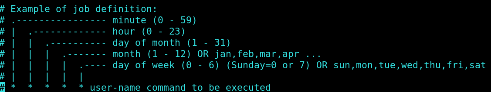

<!-- backgroundColor: #F0000 -->

# Linux Tricks Book

## by **Mohammadali Azani**

---

# **Lesson 1: Basics**

---

# commands

* whoami ==> to see your username in linux
* su USERNAME ==> is for swtich between users
* passwd USERNAME ==> change users password
* useradd USERNAME ==> This will add a new user
* clear or ctrl+l ==> to clean the terminal screen
* userdel  -r USERNAME ==> for delete a user and -r is for recursive that allows us to remove the user home directory

---

# **Lesson 2: vi and nano**

---

# command

* ls ==> to show us the list of our files
* vi ==> This is wonderfull text editor in linux

---

# vi modes

* command mode ==> Press **Esc**
* insert mode ==> Press **i**
* x mode ==>  **:**

---

# vi shorcuts in command mode

* Shift + l ==> go to the last line of current page ==> last line
* Shift + h ==> go to the first line of current page ==> head
* Shift + g ==> go to the last line of file ==> go
* NUM + Shift + g  OR NUM +  gg ==> go to the NUM line of file
* NUM yy ==> copy or yanking NUM line
* yG ==> copy all text from current line to the last line
* NUM dd ==> delet or cut NUM lines of text
* **p** ==> paste the copied or cutted text to the underneath line
* **P** ==> paste the copied or cutted text to the upper  line
* cc ==> remove the text of current line and goto insert mode  
* R ==> goto replace mode and rewrite everything

---

* u ==> undo
* Ctrl+r ==> redo
* Shift + 4 = $ ==> go to end of current line
* 0  ==> go to start of current line
* o ==> open a line below
* O ==> open a line at the top of current line

---

# Search and replace in vim

## search ==> /NAME or ?NAME

* n ==> hit n to goto the next one

## search and replace ==>

* :%s/search-name/replace-name/ ==> replace **just 1st one** search name in all lines ==> xmode
* % ==> for lines
* /g ==> global for a line
* :%s/search-name/replace-name/gc ==> make the changes global and replace all the search name for entire line and for all lines with confirmation(c)==> xmode

---

# x mode commands

* **:x or :wq** ==> save and exit
* q => quit
* w => write
* ! => don't care about changes
* **:w!** ==> save the file without exit
* **q!** ==> quit without saving
* **:wq!** ==> force save and exit
* : **r** /file-path/file-name ==> open(read) a file in vim
* : **e** /file-path/file-name ==> edit new file and open it

---

* **:!** terminal-commands ==> to run terminal commands like ls, pwd , ...
* bufffer NUM ==> to changes between multiple files
* buffer! NUM ==> don't save the changes and go to NUM file
* bp ==> previous buffer
* bn ==> next buffer

---

# **Lesson 3: user and groups**

---

# commands

* sudo ==> allows us to run a command as superuser(root)
* cat ==> to read the file content on terminal or concatenate text
* visudo ==> allows to edit /etc/sudoers.d
* usermode -G GROUPNAME USERNAME ==> change the primary group of USERNAME to GROUP NAME
  * -G is for change primary group
* groupadd GROUP-NAME ==> Create a group

* groups USERNAME ==> shows us the primary group of USERNAME

* w ==> shows us all logged in users

---

# to give all priviledges to a user in visudo

#### write username under the root user and done it's like this

# User privilege specification

root    ALL=(ALL:ALL) ALL
Ali     ALL=(ALL:ALL) ALL

---

# Add user to sudo group

We can add user to sudo group too:
And this is much same as root

%sudo   ALL=(ALL:ALL) ALL NOPASSWD:ALL

**NOPASSWD:ALL** ==> don't ask user for password

---

# **Lesson 4: File Premissions**

---

# Commands

* wget FILE-LINK ==> to download a package
* ls -la ==> list of files
  * **-l** is long list
  * **-a** is for all files (include hidden files)

* touch FILENAME==> to create a file
* chmod -R DIRECTORY-NAME 755 ==> change mode of file or  directory
  * **-R** is for recursive and change permission of directory and all content of it
* tail -f FILE-NAME ==> show the tail of file
  * **-f** is for show us live any changes

---

* **d**(rwx) (r-x) (r-x)
  * **d** ==> means it's a directory

* **-** (rw-) (r-x) (r-x)
  * **\-** ==> means it's a file

### in file permissions we have 3 groups

1. Owner of file
2. Member of groups
3. Others

---

## drwxr-xr-x

* r ==> read
* w ==> write
* x ==> execute

---

## rwx

* x = 2^0 = 1
  * or [u(user) | g(group) | o(others)] [+ | -] x
* w = 2^1 = 2
  * or [u(user) | g(group) | o(others)] [+ | -] w
* r = 2^2 = 4
  * or [u(user) | g(group) | o(others)] [+ | -] r

---

## chown

* This for change the owner of the file
* You should run this like below:
  * chown -R USER:GROUP file-name or USER.GROUP USERNAME
    * -R is for recursive

---

# **Lesson 5: CronJob**

---

* command ==> **crontab -e** and then you can edit and add your job or you can use vim /etc/crontab
* Here is the guide for this:
* 
* And we have this sample : # m h  dom mon dow   command
  * if we say ***** mkdir /home/ali/Desktop/new
    * It will make new directory every min

---

* For every n minutes ==> */n
* For n to m ==> n-m
* For n and m ==> n,m
* Example:
  * */20 2-4 ** fri,sun
  This will run the job every 20 min in 2 to 4 Am every friday and every sunday

---

# **Lesson 6: Package management**

---

# Debian and Ubuntu ==> apt and dpkg

---

# **Apt**

* /etc/apt ==> is the location of sources.list and in sources.list we have repos
* you can add repos of another program to download and update them ==> **security risk**
* apt install PACK-Name => to install a package
  * -y ==> means yes when ask yes/no to install
  * -s ==> is for simulation
* apt source PACK-Name ==> to download the source file
* apt search Pack-Name => to search a package

---

## **diffrence between upgrade and dist-upgrade**

* dist-upgrade ==> will install and upgrade kernel and install it
* upgrade ==> is for update packages not kernel

---

## **apt-cache**

* apt-cache stats ==> show us the status of downloaded package infos
* apt | apt-cache depends PACK-Name ==> show the dependencies of a package
* apt-cache pkgnames or apt list ==> to list all the packages

---

# **dpkg**

* cat /etc/issue ==> show us our architecture
* uname -a ==> to figure out 32 or 64 bit
* dpkg -i(--install) PACK-NAME ==> to install a package
* dpkg --get-selections ==> to get all the installed package
* dpkg -L PACKAGE_NAME ==> to see all the files and locations of file of a package that installed
* dpkg-reconfigure PACK-NAME ==> to reconfig a package after reinstall or update
* to install depnces of dpkg package
  * apt-get update
  * apt-get -f(--fix-broken) upgrade ==> to fix depedences of a package

---

* dpkg --remove PACKAGE-NAME ==> to remove a package **Don' remove configuration file**
* dpkg --purge PACK-NAME ==> to remove a package **includes configuration file**

---

# **dselect**

* It's a kind of gui interfaces of apt in debian

---

# Centos and redhat ==> yum and rpm

---

# **RPM**

* whereis nano ==> to see the location of a package
* we can't install a package when a package with the same name exist
* rpm -i PACKAGE-NAME ==> install the package
* rpm -e PACKAGE-NAME ==> unistall the package
* rpm -ihv PACKAGE-NAME
  * -h ==> show the progress
  * -v ==> for verbose
* rpm -q PACKAGE-NAME ==> quries the package
* rpm -qi PACK ==> show the installation information
* rpm -q --list PACK ==> to see the location of all installed files

---

* rpm -qR PACK ==> to see the requirments of a package
* rpm -u PACK ==> to upgrade the package
* rpm -f PACK ==> to upgrade the package
* rpm --rebuilddb ==> to rebuild database after remove or install a package

---

# **yum**

* To add repos ==> cd /etc/yum.repoes.d and you can find them there
* yum update ==>update and ask for upgrade
* yum check-update ==> to see if updates are available
* yum search PACK ==> to search for a package
* yum upgrade ==> to upgrade all the packages
* yum remove PACK ==> to remove a package
* yum list PACK ==> to show us the information about the package
* yum info PACK ==> to show us the installation of a package
* yum deplist PACK ==> to see the dependecies of a package

---

* yum --force install PACK ==> to make force to install package without dependncies
* yum clean { all | packages | } ==> to clean the installation files and another usless files

---

## **Warning:** Don't need to reboot after upgrade like microsoft windows

---

# **Lesson 7: System Resources**

---

# commands

* top (htop) ==> to monitor the system resources
  * shift + m ==> sort by memory
  * shift + p ==> sort by cpu
  * r ==> to renice a pid we should first enter the pid and then the nice number
    * Best priority number = -20
    * Worst priority number = 20
  * k ==> kill a process
* kill ==> To send signal to proces like kill
  * -L ==> to see the list of signals

---

# **Lesson 8: Find files**

---

# Command

* locate ==> first you should use updatedb to update the database of files
* find /etc -name '*motd\*'==> most powerful command to find files like motd in /etc

---

# **Lesson 9: wc, split, cat, diff**

---

# cat

* concatenate 2 files
  * cat file1 file2 > file1_and_file2
* we can use cat to read small files too
* but it's better to use **less** to read file contents

---

# wc

* wc used for world count
  * first result ==> line count -l
  * second result ==> word count -w
  * third result ==> bytes count -c
  * -m ==> character count

---

# split

* we can use split to split our file to files
  * split -l 2 file
    * -l ==> line

---

# diff

* look at the difference between 2 files
* diff file1 file2

---

# **Lesson 10: Streams**

---

# stdout

* ls -la > file ==> write the standard output in a file
* echo "Message would be send to stdout" ==> Message would be send to stdout
* ls -ltrh >> file ==> append the standard output to entire file
* touch is for create a file

---

# stderr

* lssss 2> errfile ==> to write the error message to errfile
* lsss 2>> errfile ==> to append the error message to the file
* ls nofile 2>> /dev/null ==> to get rid of error message on the screen

---

# how to redirect stdout and stderr to 2 files or 1 file

* cat file1 nofile_exist file2 >> output  2>> errmessage ==> to redirect stdout and stderr to 2 seprate files
* cat file1 nofile_exist file2 >> output  2>&1 ==> redirect stdout and stderr to one file
* cat file1 no_file_exist &> out ==> to write stderr and stdout to a file
* cat file1 no_file_exist &>> out ==> to append stderr and stdout to a file
* set -o noclobber ==> can't overwrite to a file and we will get error for this line:
  * cat file1 > output
* set +o noclobber ==> to set back to default and can overwrite to a file again

---

# **Lesson 11: Pipes**

---

* allow us to take output from one command and put it to input of another commands
  * ls -ltrh /etc **|** grep cron

---

# **Lesson 12: grep, fgrep, egrep**

---

# grep

* grep REGEX FILE ==> to find a regex in a file
  * grep ^hello file ==> find all the hello at the beggining of the file
  * -c ==> is for count
  * grep hello$ file ==> find all the hello at the end of the line
  * grep [CHARACTERS] file ==> search for any of character in the bracket for exmp :
  grep [hello] file ==> will find all the h, e, l, l, o chars in file
  * -i ==> incase sensitive
  * [a-z] ==> find all the chars from **a** to **z**
  * grep -f GREPINPUT file ==> find GREPINPUT content in file
  * grep -lr
    * -r ==> recursive
    * -l ==> print only the matches file

---

# egrep (extended global regular expression print)

* egrep 'hello.*world' file
  * . ==> every char
  * \* ==> 1 to unlimit
* egrep 'hello | world' file ==> lines have hello or world
  * | ==> or
* -v ==> not match patterns(versus)
* egrep 'hello|world' testf | grep -v jeff ==> line that contains hello and world but doesn't contain jeff in lines
* **grep -E** ==> is the same **egrep**
* **grep -F** ==> is the same **fgrep**

---

# fgrep

* Doesn't support any **regular expression**
* And each character has it's meaning
* example:

1. $ grep hello$ testf --color

    you are how hello
    world hello
    jeff hello
    hello
2. $ fgrep hello$ testf --color
hello$

---

# **Lesson 13: cut command**

---

# cut

* example of usage:
just cut a part of file for example uernames in passwd files
* cut -f1 -d: passwd
  * -f ==> field or list
  * -d ==> delimiter

---

# **Lesson 14: Stram editor(sed)**

---

# sed

* search and replace command stands for Stream editor
* example:
  1. sed 's/fulltime/parttime/' ==> change all fulltime to parttime
  2. sed 's/fulltime/parttime/w new.txt' ==> change all fulltime to parttime and just write the changes to new.txt file
  3. sed '/fulltime/w new.txt' ==> search for fulltime and write them in new.txt file
  4. sed '/fulltime/w new.txt' > /dev/null ==> same as 3 but not show any thing
  5. sed '0,/parttime/s/parttime/promotion/' ==> search and replace just the first parttime with promotion
  6. sed 's/<[^>]*>//' filename ==> remove <html> and <body>
  * [^c] ==> will match all character except for the one mentioned in braces(c)
  * s ==> substitute
  * w ==> write

---

# **Lesson 15: tee**

---

# tee

* show stdout of command to screen and save it to a file too
* -a ==> append (default is write and overwrite)
* look at the bellow results:

1. $ls
  file1

    $ls > file2

    $ cat file2
    file1
    file2

---

2. $ls | tee file3
    file1
    file2
    file3

    $cat file3
    file1
    file2
    file3

---

# **Lesson 16: /Sys, /proc, /dev, /var**

---

* everything in linux is a file
* /bin is for none essential commands binary
* /sbin is for essential commands binary for running system
* /etc is boot type information like fstab and other things such as samba for share
* /sys is linked to kernel and virtual file
* /proc is linked to kernel and virtual file
* /proc is for proccess are running in our system
* /proc/uptime ==> the system uptime in seconds
* /proc/version ==> the version of system and kernel
* /proc/meminfo ==> to see the momery info s
* /proc/filesystems ==> the file system we can read and write to them

---

* **more** command is like **less** but less is faster because it'snot to load the whole file at once
* /proc ==> shows us the proccess
  * example:
    1. run firefox
    2. ps aux | grep firefox
    3. ls pid firefox in /proc
    4. cd to pid directory
    5. ls -la ==> see the exe

---

# /dev

* contains file reffrence to hardware devices and it's components
* df -h ==> disk free -human-readable

*
---

# **Tmux**

---

* Ctrl + b + % ==> split the terminal vertically
* Ctrl + b + " ==> split the terminal horitezntally
* Ctrl + b + t ==> show the time to us
* Ctrl + b + arrows(->) ==> to change between splited part
* Ctl + b + z(zoom) ==> to zoom to current splited part and zoom out too
* ctl + b + c(create) ==> create new terminal that'snot splitted
* Ctrl + b + NUMBER ==> go to the NUMBER bash
* Ctrl + b + d(detach) ==> detach tmux with out close it
* tmux ls ==> to see the sessions
* tmux attach -t SESSION-NUMBER ==> to attach to session
* Ctrl + b + Ctrl + arrows(->) ==> to change size of each splited part

---

* Ctrl + b + : ==> command mode
* setw synchronize-panes on ==> to type same thing on all the panels
* tmux new -s SESSION-Name ==> to create new session
* Ctrl + b + page up | page down ==> to scroll
* Ctrl + s ==> search
* Ctrl + b + s ==> list of windows
* q to exit scroll mode
* Ctrl + b + ? ==> help
