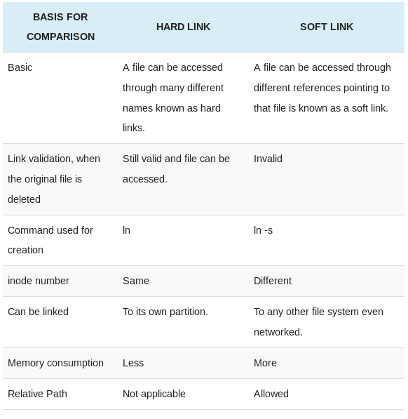

<!-- backgroundColor: #F0000 -->

# Linux Tricks Book

## by **Mohammadali Azani**

---

# **Basics**

---

# commands

* whoami ==> to see your username in Linux
* su USERNAME ==> is for switch between users
* passwd USERNAME ==> change users password
* useradd USERNAME ==> This will add a new user
* clear or ctrl+l ==> to clean the terminal screen
* userdel  -r USERNAME ==> for delete a user and -r is for recursive that allows us to remove the user home directory

---

# **vi and nano**

---

* ls (list) ==> to show us the list of our files
* vi ==> This is wonderful text editor in Linux

---

# vi modes

* command mode ==> Press **Esc**
* insert mode ==> Press **i**
* x mode ==>  **:**
* Visual mode ==> press **v**

---

# vi shortcuts in command mode

* Shift + l ==> go to the last line of current page ==> last line
* Shift + h ==> go to the first line of current page ==> head
* Shift + g ==> go to the last line of file ==> go
* NUM + Shift + g  OR NUM +  gg ==> go to the NUM line of file
* NUM yy ==> copy or yanking NUM line
* yG ==> copy all text from current line to the last line
* NUM dd ==> delete or cut NUM lines of text
* **p** ==> paste the copied or cut text to the underneath line
* **P** ==> paste the copied or cut text to the upper  line
* cc ==> remove the text of current line and goto insert mode  
* R ==> goto replace mode and rewrite everything

---

* u ==> undo
* Ctrl+r ==> redo
* Shift + 4 = $ ==> go to end of current line(like regex)
* Shift + 6 = ^ ==> go to start of current line(like regex)
* 0  ==> go to start of current line
* o ==> open a line below
* O ==> open a line at the top of current line
* x ==> remove one character
* r ==> replace one character

---

* a ==> append and goto insert mode
* A ==> append and goto end of line the goto insert mode
* dw/de ==> delete a word/ delete to end of word
* J ==> join lines
* . ==> repeat the last command
* % ==> go to the end of brackets
* \> ==> in visual mode indent all the selected block 

---

# to highlight the searched element in vim with color

* run these command in command mode:

1. set hlsearch
2. hi Search ctermbg=LightYellow
3. hi Search ctermfg=Red
4. set paste ==> to go to paste mode

---

# Some tricks

* :vs or vsplit  ==> to split the terminal vertically

* :terminal ==> to open a terminal

* :split or :sp ==> to split terminal horizontally

* Ctrl + w + arrows ==> to move to the splited part in command mode

* :Explore ==> go to some kind of file exploring in gui

* :sort ==> sort the selected part in visual mode

* 

---

# Search and replace in vim

## search ==> /NAME or ?NAME

* n ==> hit n to go to the next one

## search and replace ==>

* :%s/search-name/replace-name/ ==> replace **just 1st one** search name in all lines ==> xmode
* % ==> for all lines
* 18,37s/old-text/new-text ==> replace the old-text with new-text in 18 to 37 lines
* /g ==> global for a line
* :%s/search-name/replace-name/gc ==> make the changes global and replace all the search name for entire line and for all lines with confirmation(c)==> xmode

---

# x mode commands

* **:x or :wq** ==> save and exit
* q => quit
* w => write
* ! => don't care about changes
* **:w!** ==> save the file without exit
* **q!** ==> quit without saving
* **:wq!** ==> force save and exit
* : **r** /file-path/file-name ==> open(read) a file in vim
* : **e** /file-path/file-name ==> edit new file and open it

---

* **:!** terminal-commands ==> to run terminal commands like ls, pwd , ...
* !! or :.!command ==> insert the output of command to our file
* :buffer NUM ==> to changes between multiple files
* :buffer! NUM ==> don't save the changes and go to NUM file
* :bp ==> previous buffer
* :bn ==> next buffer
* :bd ==> delete buffer
* :b NAME ==> go to buffer with name NAME
* :ls ==> show the list of buffers

---

# **user and groups**

---

* sudo ==> allows us to run a command as superuser(root)
* cat ==> to read the file content on terminal or concatenate text
* visudo ==> allows to edit /etc/sudoers.d
* usermode -G GROUPNAME USERNAME ==> change the primary group of USERNAME to GROUP NAME
  * -G is for change primary group
* groupadd GROUP-NAME ==> Create a group

* groups USERNAME ==> shows us the primary group of USERNAME

* w ==> shows us all logged in users

* who -a ==> to see logged in users

* users ==> to see logged in users

---

# to give all privileges to a user in visudo

## write username under the root user and done it's like this

# User privilege specification

root    ALL=(ALL:ALL) ALL
Ali     ALL=(ALL:ALL) ALL

---

# Add user to sudo group

We can add user to sudo group too:
And this is much same as root

%sudo   ALL=(ALL:ALL) ALL NOPASSWD:ALL

**NOPASSWD:ALL** ==> don't ask user for password

---

# **File Permissions**

---

# Commands

* wget FILE-LINK ==> to download a package
* ls -la ==> list of files
  * **-l** is long list
  * **-a** is for all files (include hidden files)

* touch FILENAME==> to create a file
* chmod -R DIRECTORY-NAME 755 ==> change mode of file or  directory
  * **-R** is for recursive and change permission of directory and all content of it
* tail -f FILE-NAME ==> show the tail of file
  * **-f** is for show us live any changes

---

* **d**(rwx) (r-x) (r-x)
  * **d** ==> means it's a directory

* **-** (rw-) (r-x) (r-x)
  * **\-** ==> means it's a file

## in file permissions we have 3 groups

1. Owner of file
2. Member of groups
3. Others

---

## drwxr-xr-x

* r ==> read
* w ==> write
* x ==> execute

---

## rwx

* x = 2^0 = 1
  * or [u(user) | g(group) | o(others)| a(all)] [+ | -] x
* w = 2^1 = 2
  * or [u(user) | g(group) | o(others)| a(all)] [+ | -] w
* r = 2^2 = 4
  * or [u(user) | g(group) | o(others) | a(all)] [+ | -] r

---

## chown

* This for change the owner of the file
* You should run this like below:
  * chown -R USER:GROUP file-name or USER.GROUP USERNAME
    * -R is for recursive

---

# **CronJob**

---

* command ==> **crontab -e** and then you can edit and add your job or you can use vim /etc/crontab
* Here is the guide for this:
* 
* And we have this sample : # m h  dom mon dow   command
  * if we say \* \* \* \* \* mkdir /home/ali/Desktop/new
    * It will make new directory every min

---

* For every n minutes ==> */n
* For n to m ==> n-m
* For n and m ==> n,m
* Example:
  * */20 2-4 \* \* fri,sun
  This will run the job every 20 min in 2 to 4 Am every friday and every sunday

---

# **Package management**

---

# Debian and Ubuntu ==> apt and dpkg

---

# **Apt**

* /etc/apt ==> is the location of sources.list and in sources.list we have repositories
* you can add repositories of another program to download and update them ==> **security risk**
* apt install PACK-Name => to install a package
  * -y ==> means yes when ask yes/no to install
  * -s ==> is for simulation
* apt source PACK-Name ==> to download the source file
* apt search Pack-Name => to search a package

---

## **difference between upgrade and dist-upgrade**

* dist-upgrade ==> will install and upgrade kernel and install it
* upgrade ==> is for update packages not kernel

---

## **apt-cache**

* apt-cache stats ==> show us the status of downloaded package infos
* apt | apt-cache depends PACK-Name ==> show the dependencies of a package
* apt-cache pkgnames or apt list ==> to list all the packages

---

# **dpkg**

* cat /etc/issue ==> show us our architecture
* uname -a ==> to figure out 32 or 64 bit
* dpkg -i(--install) PACK-NAME ==> to install a package
* dpkg --get-selections ==> to get all the installed package
* dpkg -L PACKAGE_NAME ==> to see all the files and locations of file of a package that installed
* dpkg-reconfigure PACK-NAME ==> to reconfigure a package after reinstall or update
* to install dependencies of dpkg package
  * apt-get update
  * apt-get -f(--fix-broken) upgrade ==> to fix dependencies of a package

---

* dpkg --remove PACKAGE-NAME ==> to remove a package **Don' remove configuration file**
* dpkg --purge PACK-NAME ==> to remove a package **includes configuration file**

---

# **dselect**

* It's a kind of gui interfaces of apt in debian

---

# Centos and redhat ==> yum and rpm

---

# **RPM**

* whereis nano ==> to see the location of a package
* we can't install a package when a package with the same name exist
* rpm -i PACKAGE-NAME ==> install the package
* rpm -e PACKAGE-NAME ==> uninstall the package
* rpm -ihv PACKAGE-NAME
  * -h ==> show the progress
  * -v ==> for verbose
* rpm -q PACKAGE-NAME ==> queries the package
* rpm -qi PACK ==> show the installation information
* rpm -q --list PACK ==> to see the location of all installed files

---

* rpm -qR PACK ==> to see the requirements of a package
* rpm -u PACK ==> to upgrade the package
* rpm -f PACK ==> to upgrade the package
* rpm --rebuilddb ==> to rebuild database after remove or install a package

---

# **yum or dnf**

* To add repositories ==> cd /etc/yum.repoes.d and you can find them there
* yum update ==> update and ask for upgrade
* yum check-update ==> to see if updates are available
* yum search PACK ==> to search for a package
* yum upgrade ==> to upgrade all the packages
* yum remove PACK ==> to remove a package
* yum list PACK ==> to show us the information about the package
* yum info PACK ==> to show us the installation of a package
* yum deplist PACK ==> to see the dependencies of a package

---

* yum --force install PACK ==> to make force to install package without dependencies
* yum clean { all | packages | } ==> to clean the installation files and another useless files

---

## **Warning:** Don't need to reboot after upgrade like microsoft windows

---

# **System Resources**

---

# Top

* top (htop) ==> to monitor the system resources
  * shift + m ==> sort by memory
  * shift + p ==> sort by cpu
  * r ==> to re-nice a pid we should first enter the pid and then the nice number
    * Best priority number = -20
    * Worst priority number = 20
  * k ==> kill a process
  * q ==> to quit
  * s ==> change process update rate
  * m ==> change style or remove memory usage

---

* -d ==> delay

* -p ==> process id

* -n ==> number of updates for example:
  * top -n 2 ==> 2 times will update and show

* -b ==> batch mode and it's useful for write top information like log file

---

* kill ==> To send signal to process like kill
  * -L ==> to see the list of signals

* uptime ==> will show us the system up time

---

# **Find files**

---

# locate

* locate ==> first you should use **updatedb** to update the database of files

* This tool is indexing all of the files and is faster than find command but less flexible

* /etc/updatedb.conf ==> is the configuration for update-db command

  * BIND_MOUNT ==> allows us to mount all or part of another file system

  * PRUNE_BIND_MOUNT ==> ignore bind mount points

  * PRUNE_FS ==> the file systems we want ignore them

  * PRUNE_NAME ==> the extension or name we want ignore them like .git

  * PRUNE_PATH ==> the path we don't want to index them by updatedb and we want to ignore them

---

# find

* find DIRECTORY-TO-SEARCH -name NAME-OF-FILE

  * find /etc -name '*motd\*'==> most powerful command to find files like motd in /etc

* -name ==> name of file

* -iname ==> i(ignore case sensitive) name

* -perm ==> permission of file

* -size ==> size of file
  * M ==> mega-byte
  * G ==> giga-byte

* -maxdepth ==> depth of search (sub directories level)

---

* -uid ==> files is owned by user-id

* -gid ==> files is owned by group id

* -group ==> files is owned by group name

* -user ==> files is owned by user name

* -type ==> to specify the type of file

* -exec command ==> to execute the command
  * find . -perm 777 -exec chmod 555 {} \\;

* -empty ==> empty files

* -mtime ==> modified time

---

# whereis

* search for binary, man page and libraries files and directories

* whereis pwd ==> show us the manpage location and binary files location

---

# which

* only search the PATH location

* echo $PATH ==> show us the PATH variables

* /bin/pwd ==> exactly the same as pwd that used with PATH

* which is used to locate the executable file associated with the given command by searching it in the path environment variable

---

# type

* type COMMAND ==> will show us how command will interpreted
  * for example:
  * type type ==> type is a shell builtin  
  * type ls ==> ls is an alias for ls --color=tty

---

# **wc, split, cat, diff**

---

# cat

* concatenate 2 files
  * cat file1 file2 > file1_and_file2
* we can use cat to read small files too
* but it's better to use **less** to read file contents

---

# wc

* wc used for world count
  * first result ==> line count -l
  * second result ==> word count -w
  * third result ==> bytes count -c
  * -m ==> character count

---

# split

* we can use split to split our file to files
  * split -l 2 file
    * -l ==> line

---

# diff

* look at the difference between 2 files
* diff file1 file2

---

# **Streams**

---

# stdout

* ls -la > file ==> write the standard output in a file
* echo "Message would be send to stdout" ==> Message would be send to stdout
* ls -ltrh >> file ==> append the standard output to entire file
* touch is for create a file

---

# stderr

* lssss 2> errfile ==> to write the error message to errfile
* lsss 2>> errfile ==> to append the error message to the file
* ls nofile 2>> /dev/null ==> to get rid of error message on the screen

---

# how to redirect stdout and stderr to 2 files or 1 file

* cat file1 nofile_exist file2 >> output  2>> errmessage ==> to redirect stdout and stderr to 2 separate files
* cat file1 nofile_exist file2 >> output  2>&1 ==> redirect stdout and stderr to one file
* cat file1 no_file_exist &> out ==> to write stderr and stdout to a file
* cat file1 no_file_exist &>> out ==> to append stderr and stdout to a file
* set -o noclobber ==> can't overwrite to a file and we will get error for this line:
  * cat file1 > output
* set +o noclobber ==> to set back to default and can overwrite to a file again

---

# **Pipes**

---

* allow us to take output from one command and put it to input of another commands
  * ls -ltrh /etc **|** grep cron

---

# **grep, fgrep, egrep**

---

# grep

* grep REGEX FILE ==> to find a regex in a file
  * grep ^hello file ==> find all the hello at the beginning of the file
  * -c ==> is for count
  * grep hello$ file ==> find all the hello at the end of the line
  * grep [CHARACTERS] file ==> search for any of character in the bracket for example :
  grep [hello] file ==> will find all the h, e, l, l, o chars in file
  * -i ==> incase sensitive
  * [a-z] ==> find all the chars from **a** to **z**
  * grep -f GREPINPUT file ==> find GREPINPUT content in file
  * grep -lr
    * -r ==> recursive
    * -l ==> print only the matches file

---

# egrep (extended global regular expression print)

* egrep 'hello.*world' file
  * . ==> every char
  * \* ==> up to 0
* egrep 'hello | world' file ==> lines have hello or world
  * | ==> or
* -v ==> not match patterns(versus)
* egrep 'hello|world' testf | grep -v jeff ==> line that contains hello and world but doesn't contain jeff in lines
* **grep -E** ==> is the same **egrep**
* **grep -F** ==> is the same **fgrep**

---

# fgrep

* Doesn't support any **regular expression**
* And each character has it's meaning
* example:

1. $ grep hello$ testf --color

    you are how hello
    world hello
    jeff hello
    hello
2. $ fgrep hello$ testf --color
hello$

---

# **cut command**

---

# cut

* example of usage:
just cut a part of file for example usernames in passwd files
* cut -f1 -d: passwd
  * -f ==> field or list
  * -d ==> delimiter

---

# **Stram editor(sed)**

---

# sed

* search and replace command stands for Stream editor
* example:
  1. sed 's/fulltime/parttime/' ==> change all fulltime to parttime
  2. sed 's/fulltime/parttime/w new.txt' ==> change all fulltime to parttime and just write the changes to new.txt file
  3. sed '/fulltime/w new.txt' ==> search for fulltime and write them in new.txt file
  4. sed '/fulltime/w new.txt' > /dev/null ==> same as 3 but not show any thing
  5. sed '0,/parttime/s/parttime/promotion/' ==> search and replace just the first parttime with promotion
  6. sed 's/<[^>]*>//' filename ==> remove \<html> and \<body>
  * [^c] ==> will match all character except for the one mentioned in braces(c)
  * s ==> substitute
  * w ==> write

---

# **tee**

---

# tee

* show stdout of command to screen and save it to a file too
* -a ==> append (default is write and overwrite)
* look at the bellow results:

* $ls
  file1

    $ls > file2

    $ cat file2
    file1
    file2

---

* $ls | tee file3
    file1
    file2
    file3

    $cat file3
    file1
    file2
    file3

---

# **/Sys, /proc, /dev, /var**

---

# Basic

* everything in linux is a file
* /bin is for none essential commands binary
* /sbin is for essential commands binary for running system
* /etc is boot type information like fstab and other things such as samba for share
* /sys is linked to kernel and it's a virtual file

---

# Proc(Programmed Random Occurrence)

* /proc is linked to kernel and virtual file
* /proc is for process are running in our system
* /proc/uptime ==> the system uptime in seconds
* /proc/version ==> the version of system and kernel
* /proc/meminfo ==> to see the memory info s
* /proc/filesystems ==> the file system we can read and write to them

---

* **more** command is like **less** but less is faster because it's not to load the whole file at once
* /proc ==> shows us the process
  * example:
    1. run firefox
    2. ps aux | grep firefox
    3. ls pid firefox in /proc
    4. cd to pid directory
    5. ls -la ==> see the exe

---

# /dev

* contains file reference to hardware devices and it's components
* df -h ==> disk free -human-readable

* sda5 ==> extended usually for swap

* cat random or urandom ==> will show us a lot of random stuff that you can use for generate key for encryption

---

# /var

* This directory is for variables

* You can store things you don't need them after reboot in the /tmp or  /var/tmp directory

* You can see the system log in /var/log that changes after every reboot

* /var/spool/ ==> is for everything like spool for example:cron

* /var/mail ==> for send mail or mail files

---

# **System architecture and Management**

---

# lsmod

* It shows which loadable kernel modules are currently loaded(List of kernel modules)

* Contain list of /proc/modules

* or we can cat /proc/modules

* lsmod | grep snd ==> snd is for sound devices

---

# **lspci-lsusb**

---

# lspci

* Show us all of the pci

* for example lspci | grep VGA

* -v ==> verbose

* -vv ==> level 2 for verbose

* lspci -n ==> remove the name of pci

* -x ==> gives us increasing level of hexadecimal

---

* -b ==> shows us our pci bridges

* -t ==> tree view

* -s 00:1f(Intel) ==> show us the pci with 00:1f(Intel) vendor id(Kind of a search like grep)

* lspci uses /usr/share/misc/pci.ids ==> you can cat it and it shows us the information about pc's

* -i sub.ids ==> Use specified ID database instead of /usr/share/misc/pci.ids

* -m ==> Produce machine-readable output

---

# lsub

* List USB devices

* -s ==> search mechanism

* -v ==> verbose

* -d 8087:0024 ==> show us specific vendor usbs

---

# **modprobe**

---

* modprobe intelligently adds or removes a module from the Linux kernel

* modprobe jfs ==> install jfs module

* -r ==> remove a module on the kernel

* find /lib/modules/$(uname -r) -type f -name '*.ko' ==> to all of the linux kernel modules

* lsmod | grep modulename ==> to find module installed or not

* rmmod MODULE-NAME(exmp:jfs) ==> to remove a module

---

# **Grub(GNU GRand Unified Bootloader)**

---

* default linux boot loader

* we can see and edit grub configuration file in /etc/default/grub

* to show grub we should comment GRUB_HIDDEN_TIMEOUT=0 and GRUB_HIDDEN_TIMEOUT_QUIET=true(In ubuntu)

* to use the changes we should use below command:
  * update-grub

---

# Menuing system

* we can find menuing system in /etc/grub.d

* we can insert a custom option without editing these files

* We can add our menu entry by using **cp 10_linux 15_mylinux** and then vim 15_menu and add this line:
`echo "Adding 15_mylinux" >&2`and when we use `update-grub` we can see Adding 15_mylinux
  * result when we reboot the system we can see 2 same thing like below:
  * ubuntu
  * ubuntu advanced options
  * ubuntu
  * ubuntu advanced options
  * ...

---

# **Diffrentiate and optimize storage and input**

---

* we can see the storage and inputs in /dev

* sr ==> is usually for disk drive

* fd ==> usually for floppy drive

* for permanent mount a device we should use /etc/fstab

* each storage in fstab has UUID(universally unique identifier)

* blkid ==> to see the uuid

* or we can cd /dev/disk/by-uuid and see the files there by ls -la

* df -h ==> disk free
  * -h ==> human readable

---

# **Hot and Cold plug Devices**

---

# cold devices

* any device can only connected or disconnected when powered off

* connecting or disconnecting one of these devices can damage the device or computer at worst and won't work at all at best

* Each of these devices will be present as a file(when working or recognized) in the special /dev directory(Remeber, even hardware in linux treated as a file or folder)

* Only the kernel itself can talk directly to hardware, through a module/driver or built-in(complied) support.

* cpu, memory, non-usb storage devices, pci expansion card(network, video, sound, etc)

---

# Hot devices

* can be connected or disconnected at any time

* devices can be added or removed dynamically cannot be listed in filesystem

* has an entry created in /dev when it is detected

* USB Hard Drive, Usb memory stick, some firewire devices, input devices(scanner, Printers)

* HAL (Hardware Abstraction Layer) ==> picking up this hot devices and reacting to them(recognize and loading a module or logging it as unrecognized)

* DBUS(Desktop BUS) ==> responsible for telling other process about the newly discovered device

---

# **Determine hardware device resources**

---

* /proc is for the proccess that are running

* /proc is a virtual file system that contains the files and references to all the devices and resources

* cat /proc/mounts ==> to see all the file systems that mount on my system

* cat /proc/cpuinfo ==> to see the information of cpu

* cat /proc/iomem ==> to see all of the memory locations that are curently in use on a system

* for external devices we plug to the system , we use ==> /proc/irq that allocate some settings to system when we plug some device

* so we can use hardware device resources in /proc too for example: interrupts, modules, version

---

# **FHS(File Hierarchy System)**

---

* visually show file hierarchy system

---

* We can find commands like ls , cat , ... ==> in /bin

* **/** ==> is the root of standard hierarchy system(primary hierarchy)

* our boot files like kernel in ==> /boot

* our devices are in like hard-drive, cdrom , ... ==> /dev

* host settings specific configuration files ==> /etc
  * in early version of unix Bell-Labs refer etc directory which  helds everythings did not belongs anywhere-else , it was just a place put stuff but this directory redisgned and now it includes editable text configuration

* /home ==> is the home for each user

* /home/lib ==> is the libraries for /bin programes

---

* /media ==> is for removable devices like CD, DVD, usb, ...

* /opt ==> the installation of add-on application software packages

* /proc ==> kernel and hardware devices resources to see the informations and proccesses(PID)

* /root ==> the home directory for root

* /sbin ==> system binary

* /srv ==> Serve folder. It holds site specific data to be served by the system for protocols such as, ftp, rsync, www, cvs etc.

* /tmp ==> temporary files

---

* /usr(Unix System Resources) ==> the second readonly hierarchy primary for users data and contains the majority of multi-users utilities and applications and has non-essential sub-directories under it

* /var(variable) ==> contains files to which the system writes data during the course of its operations and they will changes by time

---

# **Boot Proccess**

---

* There are 2 way to see the boot messages directory:
  * /var/log
  * dmesg ==> command to see the boot proccess
* /var/log/messages ==> the informations about post boot

---

* BIOS ==> is resposible for direct access to all of the hardware that's installed on our system

* Master boot record ==> it's generally installed on the 0's sector of the hard-drive and it's responsible for identifying where your boot loader is installed

---

# Grub(GRand Unified Bootloader)

* e ==> to see the premeters you can pass to grub
  * like kernel path, the partition you use, and boot image
  * then if you hit **e** agian , you can edit the parameter

* we can force kernel to boot a single user by:
  * press e in the kernel
  * and pass the init=/bin/bash or init=signle at the end of the line

---

# **init**

---

* There are 2 types of run levels

* Run levels goes from 1 to 6

* init levels:
  1. level 0 ==> Halt(Shuts down system)
  2. level 1 ==> Single-User Mode (Does not configure network interfaces, start daemons, or allow non-root logins)
  3. level 2 ==> Multi-User Mode (Does not configure network interfaces or start daemons)
  4. level 3 ==> Multi-User Mode with Networking (Starts the system normally)
  5. level 4 ==> Undefined (Not used/User-definable)
  6. level 5 ==> X11 (As runlevel 3 + display manager(X) )
  7. level 6 ==> Reboot (Reboots the system)

---

* ls -al /sbin *nit ==> show us the init and telinit

* we should use the telinit to change run level for maintain compatibilities

* telinit LEVEL-INIT ==> to change run level
  * exmp: telinit 4 ==> to change the run level to undefined

* telinit is the same and safe way for init

---

# **File naming basics and file commands**

---

* mkdir NAME ==> to create a directory NAME

* file names, file extensions and linux are case sensitive
  * for exmp: if we create file.txt , file.TXT and FILE.txt ,these are three seprate and different files

* we can edit or create files with space by 2 trick:
  * use \ before each space
    * exmp: vi this\ file\ has\ space ==> to create single file `this file has space`

  * use  \' file name \' or \" file name\"

* the limit for file name is 256 character and we can't create a file with more than 256 char in most file systems

---

* touch .file-name ==> to create a dot file that can't seen by normal ls command and we should use ls -a(all) to see them actually they are a kind of hidden files and most of them are configuration files

---

# wild cards

* ? ==> single character
  * exmp-1: ls bac? ==> list every thing starts with bac[a - z, 0-9]
  * exmp-2: nano b??k ==> if we have 3 file: book, back, balk; it will open all 3 files

* \* ==> it means everything (0-unlimit in regex)
  * exmp: nano b*k ==> if we have 3 file: book, back, balk; it will open all 3 files

* [CHARACTERS] ==> match any characters in a set of bracket
  * exmp: if we have 4 files: cat, rat, fat, hat; ls [crh]at will list 3 files cat, rat, hat
  * exmp-2: if we have 4 files: cat, rat, fat, hat; ls [a-z]at ; list all 4 files(all files starts with char a to z and end with at)

---

# ls(list)

* -l ==> for long list

* -t ==> sort by time modification time

* -h ==> human-readable

* -s ==> sort by size

* -r ==> reverse the llist

* -d ==> list of directories

* -a ==> list all the files include dot-files(.file)

* -F (--classify) ==> append indicator (one of */=>@|) to entries

* -R ==> recursive, it shows the directories content too

---

# cp(copy)

* cp -FLAG file-name destination ==> the base of cp command

* -i ==> interactive (prompt before overwrite)

* -f ==> force

* -R or -r ==> recursive

* -p ==> preserve the ownership

* -a ==> archive

* -u ==> This stands for update and copies only when the source file is newer than the destination

---

# **Compress files**

---

# gzip

* gzip file1 ==> compress file1 and replace it with gzip file

* --stdout, -c ==> write on standard output

* -d ==> decompress

* -f ==> force

* -k(--keep) ==> to keep original file and create compressed file

* -r ==> recursive

* -1(--fast) ==> fast compression

* -9(--best) ==> best compression

---

# gunzip

* gunzip file1.gz ==> decompress the file1.gz and replace it with extracted file

* --stdout, -c ==> write on standard output

* -f ==> force

* -k(--keep) ==> to keep original file and create compressed file

* -r ==> recursive

---

# tar

* It's for archive and compress files

* tar -cJf file.xz file* ==> to create xz archive and compress it

* -x ==> extract

* -J ==> xz

* -j ==> bzip2

* -z ==> gzip

* -a ==> auto-compress

---

* -f ==> file

* -c ==> create or compress

* -r(--append) ==> append

* -t(--list) ==> list of files in tar file

---

# cpio

*

---

# **Links**

---

# links

* A link in UNIX is a pointer to a file. Like pointers in any programming languages, links in UNIX are pointers pointing to a file or a directory. Creating links is a kind of shortcuts to access a file. Links allow more than one file name to refer to the same file, elsewhere.

---

---

# soft(symbolic) link

* It's a special file type

* **l** rwx rwx rwx ==> first l show us it's soft link

* Kind of shortcut to file location and is a bit slower than hard links

* We can use for different file systems( Beacause of different inode)

* Removing or moving soft link doesn’t affect anything but removing original file, the link becomes “dangling” link which points to nonexistent file.  

* Link across filesystems: If you want to link files across the filesystems, you can only use symlinks/soft links(You can't create hard link to cdrom or external hard)

---

* soft links contains the path for original file and not the contents

* original file and linked file has different inode number

* As similar to hard links, any changes to the data in either file is reflected in the other

* ln  -s [original filename] [link name]

* ln -is [new original filename] [link name] ==> to change to new link with ask

* ln -fs [new original filename] [link name] ==> to change to new link with no asking

---

# hard link

* It's a seprate file

* **\-** rwx rwx rwx ==> - show us it's regular file

* can't be use in different file systems and Link across filesystem( because of same incode)

* Can not use hard link for directories

* reference to the core file

* removing original file, does not effect to the linked file

* Makes any changes to 1 file will affect for both files(original file and linked file)

---

* hard links always refer to the source, even if moved or removed.

* if we move the source file of hard links they will work correctly

* original file and linked file has same inode number

* ln  [original filename] [link name] or ln -P [original filename] [link name]

* ln -i [new original filename] [link name] ==> to change to new link with ask

* ln -f [new original filename] [link name] ==> to change to no asking

---

# **copy vs links**

---

* soft link would not use any spaces on the storage so it help us save our storage

* hard link will use our storage but if we remove the original file , the linked file will work properly and keep in mind if we change 1 file , the other file will be change and this is the option copy doesn't have it.

---

# **Permissions in linux**

---

* sh PROGRAM.sh ==> to run shell programmes

* we have 12 bits for permission for each file or directory or link(every type file in linux)

* 0(suid) 0(sgid) 0(sticky bit) rwx rwx rwx

---

# suid(set user id)

* It's for executable files

* run the program with permission of owner of the file

* These permissions allow the file being executed to be executed with the privileges of the owner. For example, if a file was owned by the root user and has the setuid bit set, no matter who executed the file it would always run with root user privileges

* can't use it for directories

* -rws rwx rwx
  * x user to S ==> if we don't have execute permission
  * x user to s ==> if we have execute permission

* chmod u+s or 4\-\-\- FILE-NAME ==> to set uid

---

# sgid(set Group id)

* When the Set Group ID bit is set, the executable is run with the authority of the group. For example, if a file was owned by the users’ group, no matter who executed that file it would always run with the authority of the user’s group.

* When the setgid bit is set on a directory, all files created within said directory inherit the group ownership of that directory. For example, the folder1 folder is owned by the user user1, and the group group1

* -rwx rws rwx
  * x user to S ==> if we don't have execute permission
  * x user to s ==> if we have execute permission

* chmod g+s or 2\-\-\- FILE-NAME ==> to set uid

---

# Sticky bit

* When the sticky bit is set on a directory, only the root user, the owner of the directory, and the owner of a file can remove files within said directory

* -rwx rwx rwt
  * x user to T ==> if we don't have execute permission
  * x user to t ==> if we have execute permission

* chmod o+t or 1\-\-\- FILE-NAME ==> to set uid

---

# **permissions**

---

# newgrp

* groupadd GROUP-NAME ==> to add new group

* newgrp GROUP-NAME ==> The newgrp command is used to change the current real group ID to the specified group during a login session

---

# umask

* the umask command returns, or sets, the value of the system's file mode creation mask

* -S ==> Accept a symbolic representation of a mask, or return one

* umask [u | g | o] [+- r | w | x] or umask \[0-7]\[0-7]\[0-7]

* umask u=rwx,g=rwx,o=rwx

* we can't set x(execute) for files with umask

* $umask
  022 ==> it's the default permission for most linux systems

* In Linux, the default permissions value is 666 for a regular file, and 777 for a directory

---
umask digit == default file permissions == default directory permissions
**0** == rw == rw**x**
1 == rw == rw
**2** == r == r**x**
3 == r == r
**4** == w == w**x**
5 == w == w
6 == x == (no permission allowed)
7 == (no permission allowed) == (no permission allowed)

---

# chattr(change attribute) and lsattr(list attribute)

* chattr command modifies the attributes of files, and lsattr lists (displays) them

* attributes list:
append only (a), no atime updates (A), compressed (c), no copy on write (C), no dump (d), synchronous directory updates (D), extent format (e), immutable (i), data journalling (j), project hierarchy (P), secure deletion (s), synchronous updates (S), no tail-merging (t), top of directory hierarchy (T), and undeletable (u).

* For more details go to [wikipedia link](https://en.wikipedia.org/wiki/Chattr)

---

* a (append only) ==>  The file may only be opened for writing in append mode: its existing data may not be overwritten. It cannot be deleted or renamed; hard links cannot be made to this file; most of its metadata cannot be changed. Modifying this attribute requires root privileges

* A (no atime updates) ==> When the file is accessed, its atime record is not modified, which in some situations can reduce disk I/O.

---

* C (no copy on write) ==> Files with this attribute are not subject to copy-on-write updates. If this attribute is set on a directory, new files created in that directory will have this attribute set. Note: This attribute is only effective on filesystems which perform copy-on-write. On btrfs, this attribute should be set on new or empty files. If this attribute is set after a btrfs file already contains data, the time when its data will be stable is undefined

* cp --reflink file1 /new/file1 ==> copy-on-write for file1 , this feature share data blocks for file1 and copy of it and save a lot of space in our disk and if we change part of a copied file1 , it will allocate the size of changes to it

---

* e (block extents) ==> Indicates that a file should be stored using block extents. Data is stored contiguously between two blocks, and only those two blocks must be known to find the file's data. Block extent mapping may potentially save disk space, because it reduces the number of blocks which must be listed in the file's inode.

* i (immutable) ==> Files with this attribute cannot be deleted or renamed; hard links cannot be made to this file; most of its metadata cannot be changed; data cannot be written to the file. Modifying this attribute requires root, or a process with the CAP_LINUX_IMMUTABLE capability, as set with setcap

---

* s (secure deletion) ==> If a file with this attribute is deleted, its data is overwritten with zeroes, similar to a simple shred. This attribute is ignored by ext2, ext3, and ext4 filesystems

* u (undeletable) ==> When a file with this attribute is deleted, its contents are saved, enabling their later undeletion. Undelete tools which can take advantage of this attribute include extundelete.

---

# **dd**

---

* Stands for: Copy and convert (called dd because cc is already in use by C compiler)

* dd can be used for tasks such as backing up the boot sector of a hard drive, and obtaining a fixed amount of random data

* if ==> input file

* of ==> output file

* ibs ==> read up Bytes at a time

* obs ==> write Bytes at a time

---

* skip=N ==>  skip N ibs-sized blocks at start of input

* seek=N ==> skip N obs-sized blocks at start of output

* bs ==> the number of bytes that will read and write
  * M ==> mega byte
  * G ==> giga byte

* count ==> the count of bs to copy

---

* sudo dd if=/dev/sda of=./mbr.iso bs=512 count=1 ==> backup the master boot record

* sudo dd if=/dev/sda1 of=./harddisk.iso bs=5M count=1 ==> backup the harddisk

* dd if=/dev/zero of=./zeros bs=1M count=1 ==> create a file named zeros that filled with zero and it's size is 1 mega bytes

* dd if=/dev/random of=./randomfile  count=1 ==> create a file named randomfile that filled with random characters

---

# **touch**

---

* touch command used to create, change and modify timestamps of a file

* stat FILE-NAME ==> to see the status of a file

* -a ==> change the access time

* -c ==> don't create any files

* -m ==> change only modification time

* -r ==> refrence file

---

# **Software libraries**

---

* ldconfig is used to create, udpate and remove symbolic links for the current shared libraries based on the lib directories present in the /etc/ld.so.conf

* Only .conf files need the include keyword. when adding a library location you will not use the include statement

* .so ==> stands for shared object

* By default, libraries are located in /usr/local/lib, /usr/local/lib64, /usr/lib and /usr/lib64; system startup libraries are in /lib and /lib64

* ldconfig(linker dynamic config) ==> clears and reconfigure cash for shared libraries

* ldd(List Dynamic Dependencies) PROGRAM_NAME ==> we can see the library depencies
  * Example: ldd /bin/ls

---

* **temporary add a software library**
  * we should create our directory own libarary in /usr/local/ and create our shared library into it

  * we can export the library for our shell temporary with:
export LD_LIBRARY_PATH=/usr/lib/new-library ==> we don't need run ldconfig

  * we can add multiple library with using like below:
export LD_LIBRARY_PATH=/usr/lib/new-library:/usr/lib/new-lib2 ==> we don't need run ldconfig

* **permanent add a software library**
  * for permanently add a library to our shared library we can add the library to /etc/ld.so.conf ==>  and then we should run ldconfig to reindex and refresh the shared libraries

---

# **ps(process status)**

---

* reads this information from the virtual files in /proc   filesystem

* ps ==> show the processes that are running for the current shell

* ps w ==>  Wide output. Use this option twice for unlimited width

* ps -e | ps -A | ps aux ==> show all the process on the system

* ps aux ==> BSD style to show processes

* ps -x ==> show all the processes by the owner(show the owner processes)

* ps -U USERNAME ==> show all processes of specefic user(USERNAME)

* ps -G GROUP-NAME ==> show all processes of specefic group(GROUP-NAME)

* ps r ==> show all runnig processes

* -j ==> jobs format

* -H ==> show processes hierarchy

---

* --forest ==> ASCII art procces hierarchy

* -f ==> to perform full-format listing

* -p ==> pid

* -t ==> tty

* ps L ==> list of formats

* --format or -o ==> format option example:
  * ps -eo pid,ppid,user,cmd

* -C ==> command name

---

# id command

* Print user and group information for the specified USER,
or (when USER omitted) for the current user

* --group or -g ==> show effective group id

* -G or --groups ==> show all groups id

* -n or --name ==> print name instead of number

* -r or --real ==> print real id instead of effective id

* -u or --user ==> print only effective user id

---

# **nice and renice**

---

# nice

* need root access

* nice allows us to lanunch a new program with a specified priority

* default priority of nice is 10

* nice -n -20 top ==> run the top with the highest priotity

* -20 is the highest priority and 19 is the lowest priority

* pgrep COMMAND-NAME ==> gives us the process-id of COMMAND-NAME

---

# renice

* need root access

* renice allow us to change the priority on an already running process

* -u ==> change priority level for all process under a specified user

* -p ==> change priority on a process-id

* -g ==> change priority on a group process-id

* renice -n -10 -p 1232 ==> change priority to 10 for 1232 process-id

---

# **Kill**

---

* kill command allow us to kill a process in linux

* kill -l ==> show us available signals we can use

* signal 1 ==> SIGHUB

* signal 9 ==> SIGKILL

* signal 15 ==> SIGTERM

* kill  -NUMBER-SIGNAL PID ==> kill a process by singal nubmer

* kill -SIGNAL-NAME PID ==> kill a process by singal name

---

# killall

* killall -[SIG-NUMBER or SIG-NAME] PROGRAM-NAME

* -i ==> interactive

* -u ==> Kill only processes the specified user owns

* -I ==> case insensitive

* -l ==> list

* -y ==> younger than N hours

* -o ==> older than

* -q ==> quiet

---

# **uname**

---

* uname command allows us to query system information

* -a ==> all

* -s ==> kernel name

* -v ==> kernel version

* -r ==> kernel release

* -m ==> machine hardware name

* -o ==> operating system

* -p ==> processor type

* -n ==> network hostname

---

# **Jobs**

---

* Ctrl + c ==> kill a program

* Ctrl + z ==> stop a program

* jobs ==> list of all stopped jobs and running jobs inside of terminal

* fg %JOB-NUMBER ==> to give the program back to the foreground

* dd if=/dev/zero of=/dev/null bs=100M count=100 **&** ==> running a program in background with **&**

* bg %JOB-NUMBER ==> to send a program to the background

---

# nohup

* nohup is a POSIX command to ignore the HUP signal and instructs the system to continue running it even if the session is disconnected

* nohup wget DOWNLOAD-LINK ==> example of nohup

---

# free

* The free command provides information about the total amount of physical and swap memory

* -b ==> bytes

* -m ==> mega bytes

* -g ==> gigabytes

* -h ==> human readable

* -s NUMBER-OF-SECONDS ==>  seconds

* -c ==> count

---

# **Tmux**

---

* Ctrl + b + % ==> split the terminal vertically
* Ctrl + b + " ==> split the terminal horitezntally
* Ctrl + b + t ==> show the time to us
* Ctrl + b + arrows(->) ==> to change between splited part
* Ctl + b + z(zoom) ==> to zoom to current splited part and zoom out too
* ctl + b + c(create) ==> create new terminal that'snot splitted
* Ctrl + b + NUMBER ==> go to the NUMBER bash
* Ctrl + b + d(detach) ==> detach tmux with out close it
* tmux ls ==> to see the sessions
* tmux attach -t SESSION-NUMBER ==> to attach to session
* Ctrl + b + Ctrl + arrows(->) ==> to change size of each splited part

---

* Ctrl + b + : ==> command mode
* setw synchronize-panes on ==> to type same thing on all the panels
* tmux new -s SESSION-Name ==> to create new session
* Ctrl + b + page up | page down ==> to scroll
* Ctrl + s ==> search
* Ctrl + b + s ==> list of windows
* q to exit scroll mode
* Ctrl + b + ? ==> help
